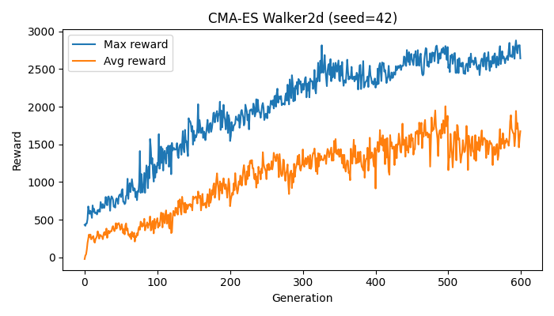
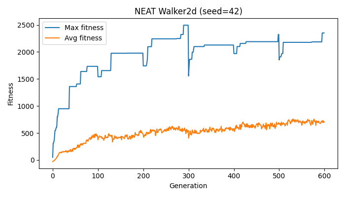
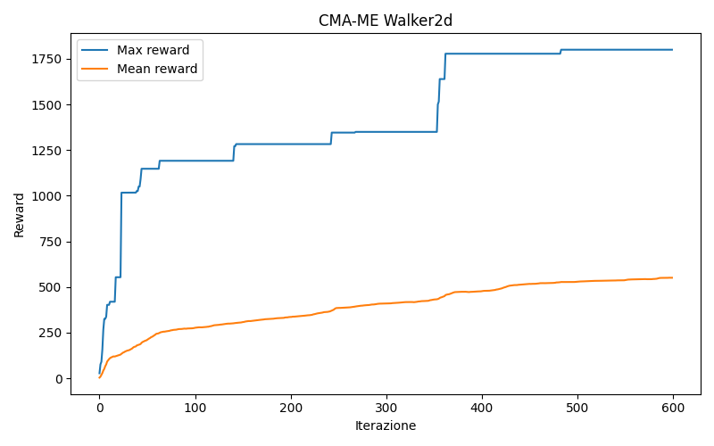
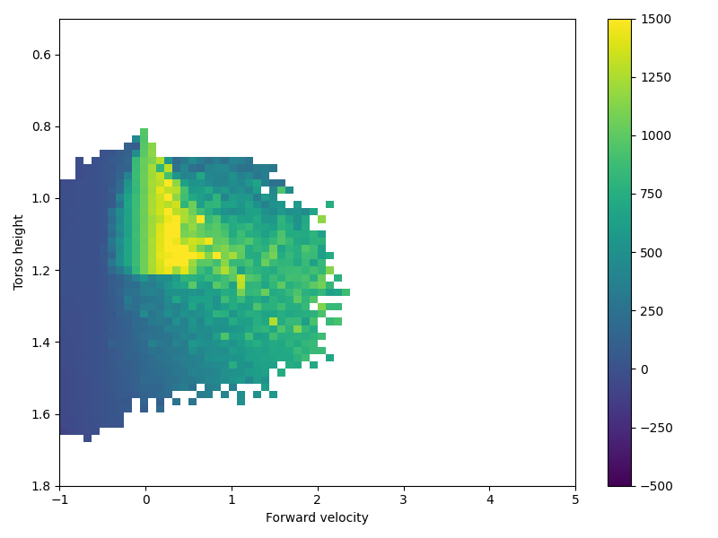

# Walker2D Evolution Suite

Walker2D with three complementary algorithms:

- **CMA‑ES** – classic evolutionary strategy on an MLP controller.
- **NEAT** – neuroevolution of augmenting topologies.
- **CMA‑ME** – grid-based MAP-Elites search with CMA emitters.

The goal is to study how different evolutionary approaches behave under noise and whether their fitness trends remain stable across repeated runs.

## Media Previews

<table>
  <tr>
    <th>CMA‑ES</th>
    <th>NEAT</th>
    <th>CMA‑ME</th>
  </tr>
  <tr>
    <td>
      
    </td>
    <td>
      
    </td>
    <td>
      
    </td>
  </tr>
  <tr>
    <td>
      
    </td>
    <td>
      
    </td>
    <td>
      
      
    </td>
  </tr>
</table>

## Repository Structure

```
CMA-ME/
├─ README.md
├─ pyproject.toml
├─ requirements.txt
└─ src/walker2d/
   ├─ algo/        # Trainers (cma_me, cma_es, neat)
   ├─ cli/         # Unified command-line entry point
   ├─ config.py    # All experiment configuration dataclasses
   ├─ eval/        # Rollout / evaluation helpers
   ├─ logging/     # Metric tracking + plotting
   ├─ persistence/ # Checkpoints and artifacts
   └─ utils/       # IO, seeding, video helpers
```

## Quick Start

```bash
python -m venv .venv
.venv\Scripts\activate
pip install -r requirements.txt
pip install -e .
```

Run any algorithm via the unified CLI:

```bash
# CMA-ES
python -m walker2d.cli.train --algo cma-es

# NEAT
python -m walker2d.cli.train --algo neat

# CMA-ME (default settings in CMAMEConfig)
python -m walker2d.cli.train --algo cma-me
```

Optional overrides: `--out-dir path/to/runs` and `--seed 1234`.

### Export video from a checkpoint

```bash
python -m walker2d.cli.resume --algo {cma-es/neat/cma-me} --checkpoint runs_neat_walker2d/checkpoint_phase06_iter0600 --output best_resume.mp4
```

If `--output` is omitted, the MP4 is written inside the checkpoint folder.

## Configuration Highlights

All knobs live in `walker2d/config.py`:

| Section             | Key fields                                                                                     |
|---------------------|-------------------------------------------------------------------------------------------------|
| `WalkerBaseConfig`  | `noise_std`, `workers`, default filenames for checkpoints, reward curves, videos, parameters.  |
| `CMAESConfig`       | `hidden_size`, `sigma0`, `pop_size`.                                                           |
| `NEATConfig`        | Every NEAT hyper-parameter (activation, mutation, species, reproduction) + automatic `.cfg` generation. |
| `CMAMEConfig`       | `num_emitters`, `emitter_batch`, `sigma0`, archive ranges + labels.                             |

Tweak values once and re‑install (`pip install -e .`) or run from source for immediate effect.

## Suggested Experiments

To check stability (as recommended in the course), repeat each algorithm with multiple noise levels and seeds:

1. Pick `noise_std ∈ {0.05, 0.10, 0.15}`.
2. For each noise level run 3 different seeds.
3. Collect average/max fitness across runs to inspect variance.

This results in 9 runs per algorithm (27 total). Use the standardized filenames to compare checkpoints.

## Outputs

Each run writes to `runs_*` (configurable):

- `checkpoint_phaseXX_iterYYYY/`
  - `state.json`, archive `.npz`, scheduler `.pkl`
  - best parameters (`best_solution.npy`, etc.) and per‑phase best
  - reward/fitness curve image + archive heatmap
  - optional best model video (`best_model.mp4`) if `allow_save_best_model_video=True`
  - noise vector dumps (`phase_XX_noise.npy/.json`)


## Troubleshooting

- **OpenCV missing?** Either install the appropriate package or keep `allow_save_best_model_video=False`.
- **NEAT config errors?** `NEATConfig` now regenerates `configs/neat_walker2d.cfg` automatically; delete stale files if necessary.
- **Performance variance?** Increase `workers`, ensure consistent seeds, and follow the suggested experiment grid.

If you extend the project (new policies, envs, or visualizations) keep the configuration and filenames consistent so that comparison across algorithms remains straightforward.